  

  
  
  

  

## `> quem_sou`

Sou **Matheus Lobo Camara**, engenheiro de software em Cuiabá/MT e **CTO & cofundador da [WebFrete](https://webfrete.com/)**. Minha zona favorita é a fronteira onde produto, arquitetura e operação se encontram.

Construo sistemas completos — do domínio e das APIs à experiência web/mobile, cloud e observabilidade. Uso IA quando ela melhora uma decisão, automatiza um fluxo ou elimina atrito real. Para mim, tecnologia só vira inovação quando chega à produção e gera impacto.

<table>
  <tr>
    <td width="33%" valign="top">
      <h3>🚀 Produto</h3>
      
Transformo problemas operacionais complexos em experiências simples, úteis e sustentáveis.

    </td>
    <td width="33%" valign="top">
      <h3>🧠 IA aplicada</h3>
      
Agentes, RAG, memória e automações conectados a processos reais — sem IA por vaidade.

    </td>
    <td width="33%" valign="top">
      <h3>⚙️ Engenharia</h3>
      
Arquitetura, segurança, testes, observabilidade e entrega contínua para software confiável.

    </td>
  </tr>
</table>

## Produto em produção

<table>
  <tr>
    <td width="58%" valign="top">
      <h3>🚚 <a href="https://webfrete.com/">WebFrete</a></h3>
      
<strong>Infraestrutura digital para o transporte rodoviário brasileiro.</strong>

      
Uma plataforma que aproxima empresas e caminhoneiros verificados, sem comissão sobre o valor do frete. Como CTO, atuo na arquitetura e na engenharia ponta a ponta: marketplace, web, app, APIs, segurança e integrações fiscais.

      

        <code>Next.js</code>
        <code>FastAPI</code>
        <code>PostgreSQL</code>
        <code>Flutter</code>
        <code>Docker</code>
        <code>GCP</code>
      

      
<a href="https://webfrete.com/"><strong>Conhecer a plataforma →</strong></a>

    </td>
    <td width="42%" align="center" valign="middle">
      
    </td>
  </tr>
</table>

## Projetos selecionados

<table>
  <tr>
    <td width="50%" valign="top">
      <h3>🍽️ <a href="https://github.com/LoboProgrammingg/Tacto-System">Tacto System</a></h3>
      
Automação e mensageria para restaurantes com agentes de IA, processamento de pedidos e memória vetorial.

      
<code>FastAPI</code> <code>PostgreSQL</code> <code>AI Agents</code> <code>Clean Architecture</code>

      <a href="https://github.com/LoboProgrammingg/Tacto-System"><strong>Explorar código →</strong></a>
    </td>
    <td width="50%" valign="top">
      <h3>💳 <a href="https://github.com/LoboProgrammingg/I.R.I.S">I.R.I.S.</a></h3>
      
Assistente financeiro <em>WhatsApp-first</em> para automação do ciclo de boletos, desenhado com DDD e arquitetura limpa.

      
<code>Python</code> <code>FastAPI</code> <code>Celery</code> <code>Redis</code> <code>PostgreSQL</code>

      <a href="https://github.com/LoboProgrammingg/I.R.I.S"><strong>Explorar código →</strong></a>
    </td>
  </tr>
  <tr>
    <td width="50%" valign="top">
      <h3>🏗️ <a href="https://github.com/LoboProgrammingg/DDD-Structure">DDD Structure</a></h3>
      
Template enterprise-grade para Python com DDD, Clean Architecture, eventos de domínio, CI e decisões arquiteturais documentadas.

      
<code>Python 3.12</code> <code>DDD</code> <code>FastAPI</code> <code>CI/CD</code> <code>Docker</code>

      <a href="https://github.com/LoboProgrammingg/DDD-Structure"><strong>Explorar código →</strong></a>
    </td>
    <td width="50%" valign="top">
      <h3>🔎 <a href="https://github.com/LoboProgrammingg/IA-MARKDOWN">Assistente Estratégico</a></h3>
      
RAG para análise contextual de documentação estruturada, com busca semântica e atualização automática do índice vetorial.

      
<code>LangChain</code> <code>FAISS</code> <code>OpenAI</code> <code>Streamlit</code>

      <a href="https://github.com/LoboProgrammingg/IA-MARKDOWN"><strong>Explorar código →</strong></a>
    </td>
  </tr>
</table>

## Meu toolkit de engenharia

  

  
  
  
  
  
  
  

## Como penso engenharia

- **Produto antes da vaidade técnica.** A melhor solução é a que resolve o problema certo e continua simples de operar.
- **Arquitetura com propósito.** Limites claros, segurança e observabilidade existem para sustentar evolução, não para decorar diagramas.
- **Produção é parte do desenvolvimento.** Logs, métricas, testes e feedback de usuários fazem parte do código.
- **IA precisa merecer seu lugar.** Se não melhora qualidade, velocidade ou decisão, provavelmente não deveria estar no fluxo.

## Pulso do GitHub

  

 

<picture>
  <source
    media="(prefers-color-scheme: dark)"
    srcset="https://raw.githubusercontent.com/LoboProgrammingg/LoboProgrammingg/output/github-contribution-grid-snake-dark.svg"
  />
  <source
    media="(prefers-color-scheme: light)"
    srcset="https://raw.githubusercontent.com/LoboProgrammingg/LoboProgrammingg/output/github-contribution-grid-snake.svg"
  />
  
</picture>

## Vamos construir algo relevante?

Gosto de conversar sobre **SaaS, sistemas distribuídos, IA aplicada, arquitetura e produto**. Se você está construindo algo que precisa sair do slide e funcionar no mundo real, vamos trocar uma ideia.

  
  

  Construindo software que conecta tecnologia, operação e impacto.

