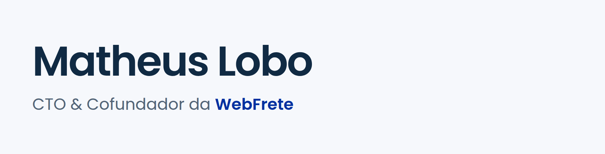

<a href="https://webfrete.com/">
  <picture>
    <source media="(max-width: 600px) and (prefers-color-scheme: dark)" srcset="./assets/cover-webfrete-mobile-dark.png" />
    <source media="(max-width: 600px)" srcset="./assets/cover-webfrete-mobile-light.png" />
    <source media="(prefers-color-scheme: dark)" srcset="./assets/cover-webfrete-desktop-dark.png" />
    
  </picture>
</a>

<h1 align="center">Matheus Lobo</h1>

  Engenheiro de software · CTO e cofundador da WebFrete · Cuiabá, Mato Grosso, Brasil 
  <em>Software engineer, CTO and co-founder of WebFrete. Python, FastAPI, TypeScript and applied AI.</em>

  <a href="https://webfrete.com/"><strong>WebFrete</strong></a>
  &nbsp; / &nbsp;
  <a href="https://www.linkedin.com/in/matheuslobocamara/">LinkedIn</a>
  &nbsp; / &nbsp;
  <a href="mailto:matheusloboo2001@gmail.com">Contato</a>

 

## Do problema de negócio ao software em produção

Sou **Matheus Lobo** (Matheus Lobo Camara), **CTO e cofundador da [WebFrete](https://webfrete.com/)**, plataforma de transporte rodoviário que conecta empresas e caminhoneiros. Conduzo arquitetura e desenvolvimento do produto, das APIs às aplicações web e mobile, integrações e infraestrutura.

Engenheiro de software em Cuiabá, MT, também sou fundador da **[Korventi Technologies](https://korventi.vercel.app/)**, onde desenvolvo software e soluções de IA para operações de negócio.

Meu foco: entender o domínio, simplificar a operação e entregar sistemas que possam ser mantidos e evoluídos.

## Projetos em destaque

### WebFrete · CTO e cofundador

Plataforma de transporte rodoviário que conecta empresas e caminhoneiros. **CTO e cofundador**, com atuação em arquitetura, APIs, aplicações web e mobile, segurança e integrações fiscais.

**Engenharia:** FastAPI, Next.js, PostgreSQL, Redis, Docker e Flutter.

[Conhecer a plataforma · webfrete.com](https://webfrete.com/)

### AMMT · Associação Médica de Mato Grosso

Ecossistema digital para a associação: **site de eventos, venda de ingressos, pagamentos via PIX e ingressos com QR code**, além da Copa AMMT, com jogos, classificação, artilharia e votação. O projeto também reúne API, painel administrativo e aplicativo em desenvolvimento.

**Engenharia:** Next.js, TypeScript, FastAPI e React Native / Expo.

[Conhecer o projeto · eventosammt.com.br](https://eventosammt.com.br/)

### KR Mecânica

Catálogo digital de **peças para máquinas pesadas e agrícolas**, com navegação por produto e solicitação de cotação pelo WhatsApp. Desenvolvimento da presença digital e da experiência de busca de peças.

[Explorar o catálogo · krmecanicakr.com.br](https://krmecanicakr.com.br/)

## Código e arquitetura

- **[DDD Structure](https://github.com/LoboProgrammingg/DDD-Structure)** — Domain-Driven Design em Python do modelo à produção: bounded contexts, agregados, eventos publicados após o commit, concorrência otimista e arquitetura verificada por contrato no CI.
- **[Boas Práticas de Engenharia](https://github.com/LoboProgrammingg/boas-praticas-de-engenharia)** — Guia em português com mais de 60 tópicos de princípios, arquitetura, testes e segurança (OWASP Top 10:2025), cada um com exemplo ruim, exemplo bom e teste.
- **[Auxiliador Bíblico](https://github.com/LoboProgrammingg/auxiliador-biblico)** — Assistente local sobre a Bíblia completa (português, hebraico e grego) com citações verificadas: nunca inventa versículos.

## Como eu trabalho

- **Testes antes de "pronto":** uma funcionalidade só entra com teste executado e verde. Ao corrigir um bug, rodo também o teste que falhava antes da correção.
- **Segurança por padrão:** autorização por política em vez de checagem de papel espalhada pelo código, segredos fora do repositório e varredura de segredos com análise estática no CI.
- **Decisões registradas:** escolhas de arquitetura viram ADRs, com contexto e consequências.
- **Entrega por Pull Request:** branch, CI verde e merge com squash, com commits convencionais e assinados.

## Tecnologias e prática

| Área | Ferramentas e abordagem |
| :--- | :--- |
| Backend | Python, FastAPI, PostgreSQL, Redis e Celery |
| Web e mobile | TypeScript, React, Next.js, React Native / Expo e Flutter |
| IA aplicada | LangGraph, LangChain, agentes, RAG e busca vetorial |
| Arquitetura | DDD, Clean Architecture, APIs e integrações |
| Operação | Docker, CI/CD, testes automatizados e observabilidade |

 

**Vamos conversar sobre seu próximo produto.** 
Arquitetura de software, plataformas digitais e IA aplicada a negócios.

[LinkedIn de Matheus Lobo](https://www.linkedin.com/in/matheuslobocamara/) &nbsp; / &nbsp; [WebFrete](https://webfrete.com/autores/matheus) &nbsp; / &nbsp; [matheusloboo2001@gmail.com](mailto:matheusloboo2001@gmail.com)
